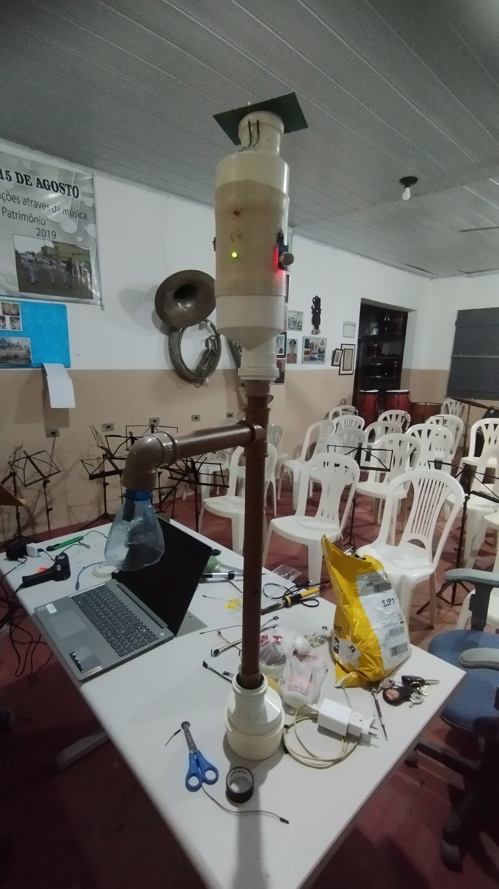

# Poste Inteligente

A tecnologia está em constante evolução! Então por que não fazer a natureza também acompanhar esse avanço?

    
    

---

O Projeto Poste Inteligente consiste numa solução sustentável para os problemas de iluminação pública. Com o auxílio de Arduino, sensores e painéis solares, o objetivo esse projeto é monitorar a qualidade do ar da região e propor o desenvolvimento de postes que utilizam energia solar para seu funcionamento.

A princípio, foi desenvolvido um protótipo menor do Poste Inteligente utilizando componentes básicos de eletrônica a fim de validar o seu uso e favorecer a produção em escala elevada, uma vez que a simplicidade do sistema inicial pode reduzir custos e ser adaptável a várias situações diferentes.

## 💡 Dois circuitos

O Poste Inteligente possui **dois** circuitos diferentes para funcionar da maneira correta. 

A energia solar captada pelo painel solar varia bastante no decorrer do dia por causas naturais, seja porque há muitas nuvens no céu, por causa do horário que faz a incidência solar ser menor na região, ou até mesmo por outros fenônemos. Para minimizar esse problema, utiliza-se um **circuito capaz de converter essa tensão solar variável em uma tensão constante** que pode ser utilzada com segurança pelos componentes eletrônicos.

Além disso, a fim de realizar o controle de quando acender o Poste e sinalizar a qualidade do ar presente no ambiente, foi usado **um circuito controlado por um Arduino** para captar os sinais dos sensores e, a partir deles, gerar ações específicas de acordo com os objetivos desse projeto

## ⚙️ Componentes

- 1 Bateria Recarregável 18650

- 1 Suporte de Bateria 1s 18650

- 1 Mini Painel Solar 3W / 12V

- 1 Diodo Schottky 1N5819

- 1 Conversor Buck-Boost XL6019

- 1 Módulo Carregador TP4056

- 1 Regulador de Tensão MT3608

- 1 Arduino Uno

- 1 Fotorresistor 

- 6 Resistores de 1kΩ

- 3 LEDs brancos de Alta Luminosidade

- 3 LEDs difusos (nas respectivas cores **vermelho**, **amarelo** e **verde**)

- 1 Sensor de Gás MQ-135

## 🛠️ Protótipo Inicial

### Circuito adaptador de Tensão

---

### Circuito com Arduino

